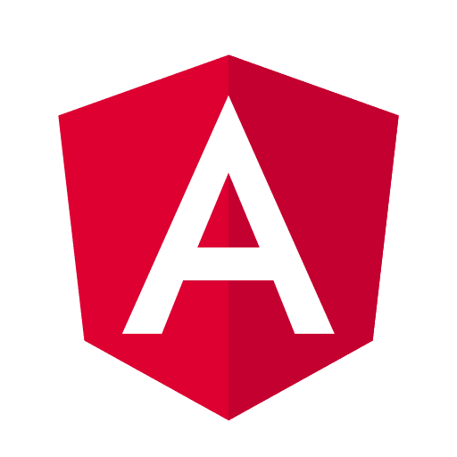

# Hemant Singh Yadav - Portfolio 🚀

Welcome to my portfolio project! This website is built using [Next.js](https://nextjs.org), and showcases my skills, projects, and professional background. It reflects my passion for crafting robust and scalable software systems that bridge the gap between front-end aesthetics and back-end functionality.

## 🌟 Live Demo
Check out the live version here: [Hemant's Portfolio](https://hemant-portfolio.vercel.app)

---

## 🎯 Key Features
- **Interactive Design**: Seamless animations and transitions powered by [Framer Motion](https://www.framer.com/motion/).
- **Modern Tech Stack**: Built with Next.js, Tailwind CSS, and other cutting-edge tools.
- **Showcase Projects**: Highlighting real-world applications I've built, complete with technologies used and live links.
- **Downloadable Resume**: Quick access to my professional resume.
- **Social Links**: Connect with me via GitHub, LinkedIn, and more.

---

## 🚀 Getting Started

To run this project locally:

1. **Clone the Repository**:
   ```bash
   git clone https://github.com/hemant10yadav/portfolio.git
   cd portfolio
   ```

2. **Install Dependencies**:
   ```bash
   npm install
   # or
   yarn install
   ```

3. **Run the Development Server**:
   ```bash
   npm run dev
   # or
   yarn dev
   ```

4. **Open in Browser**:
   Navigate to [http://localhost:3000](http://localhost:3000) to view the application.

---

## 📂 Project Structure

```plaintext
📦 portfolio
├── 📁 app
│   ├── 📄 page.tsx       # Main entry point for the application
├── 📁 components
│   ├── 📄 HeroSection.tsx # Hero section with intro and social links
│   ├── 📄 ProjectSection.tsx # Showcasing projects
│   ├── 📄 SkillSection.tsx   # Displaying tech stack
├── 📁 public
│   ├── 📁 assets          # Static assets (logos, images)
├── 📄 README.md          # Documentation
```

---

## 💻 Tech Stack

### Frontend:
- **Next.js**
- **React.js**
- **Tailwind CSS**
- **Framer Motion**

### Backend:
- **Node.js**
- **Express.js**

### Database:
- **PostgreSQL**
- **MongoDB**

### Other Tools:
- **AWS**
- **Git**
- **Jira**

---

## 🛠️ Skills

Here’s a quick overview of my technical expertise:

     
     
   

---

## 📂 Featured Projects

### [E-commerce](https://github.com/hemant10yadav/E-Commerce-website)
A highly scalable platform enabling users to browse and purchase products online.

- **Technologies**: Java, Spring Boot, Angular, TypeScript, PostgreSQL
- **Highlights**:
  - Enterprise-level performance and scalability
  - Secure and robust architecture

### [E-store](https://github.com/hemant10yadav/Sell2U-Node)
A modern store application with an interactive front-end and secure back-end.

- **Technologies**: React.js, Node.js, Express.js, MongoDB
- **Highlights**:
  - Reactive and intuitive user interface
  - Built with scalability and performance in mind

---

## 📄 Resume

Download my latest resume here:  
[Hemant's Resume](https://raw.githubusercontent.com/hemant10yadav/Resources/main/Hemant-Software-Developer-Resume.pdf)

---

## 🤝 Connect with Me

- **GitHub**: [@hemant10yadav](https://github.com/hemant10yadav)
- **LinkedIn**: [Hemant Yadav](https://www.linkedin.com/in/hemantyad)
- **Email**: [hemant.10.yadav@gmail.com](mailto:hemant.10.yadav@gmail.com)
- **Instagram**: [@h.e.m.a.n.t.10](https://www.instagram.com/h.e.m.a.n.t.10)

---

## 📦 Deploy on Vercel

The easiest way to deploy your Next.js app is to use [Vercel](https://vercel.com).

```bash
npx vercel
```

For more details, refer to the [Next.js deployment documentation](https://nextjs.org/docs/app/building-your-application/deploying).